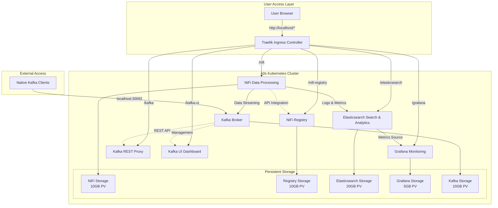
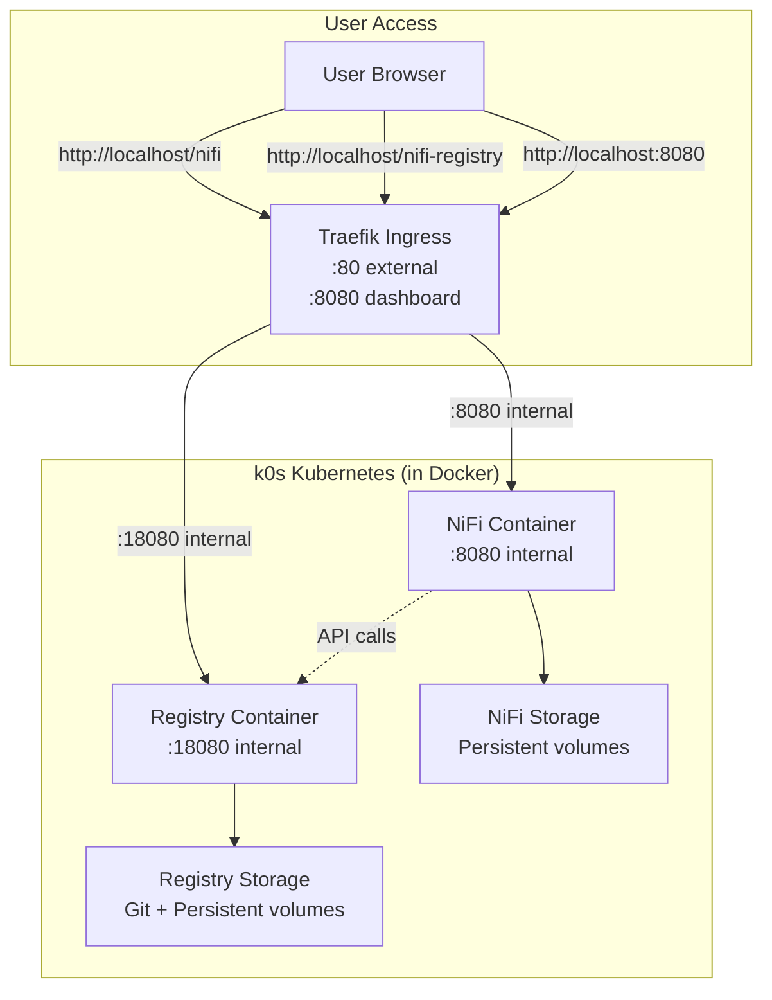

# InfoMetis

InfoMetis - container orchestration made simple.

**Purpose**: Prototype platform for lightweight, event-driven container orchestration using Kubernetes + NiFi data processing.

## 🗺️ Version Overview

| Version | Status | Focus | Documentation |
|---------|--------|-------|---------------|
| **v0.1.0** | ✅ **STABLE** | Foundation Platform | [📖 README](v0.1.0/README.md) |
| **v0.2.0** | ✅ **STABLE** | Registry Integration | [📖 README](v0.2.0/README.md) |
| **v0.3.0** | 🎯 **READY FOR USE** | JavaScript Console | [📖 README](v0.3.0/README.md) |
| **v0.4.0** | 🚀 **READY FOR USE** | Complete Analytics Platform | [📖 README](v0.4.0/README.md) |
| **v0.5.0** | 📋 **PLANNED** | AI/ML Integration | - |
| **v0.6.0** | 📋 **PLANNED** | Multi-Node Clustering | - |
| **v0.7.0** | 📋 **PLANNED** | Testing Framework | - |

## 📋 Milestone Status

| Milestone | Open Issues | Closed Issues | Status |
|-----------|-------------|---------------|---------|
| [v0.1.0: WSL NiFi Dev Platform](https://github.com/infometish/InfoMetis/milestone/1) | 4 | 4 | ✅ Complete |
| [v0.2.0: NiFi Registry with Git](https://github.com/infometish/InfoMetis/milestone/2) | 0 | 5 | ✅ Complete |
| [v0.3.0: Convert Console to JS](https://github.com/infometish/InfoMetis/milestone/6) | 0 | 8 | 🎯 Ready for Use |
| [v0.4.0: Complete Analytics Platform](https://github.com/infometish/InfoMetis/milestone/3) | 0 | 12 | 🚀 Ready for Use |
| [v0.5.0: AI/ML Integration](https://github.com/infometish/InfoMetis/milestone/5) | 8 | 0 | 📋 Planned |
| [v0.6.0: Multi-Node Clustering](https://github.com/infometish/InfoMetis/milestone/4) | 8 | 0 | 📋 Planned |
| [v0.7.0: Testing Framework](https://github.com/infometish/InfoMetis/milestone/7) | 4 | 0 | 📋 Planned |

## 🚀 Quick Start

### Latest: v0.4.0 (Complete Analytics Platform)
```bash
cd v0.4.0
node console.js
```
- **Features**: NiFi + Registry + Elasticsearch + Grafana + Kafka + JavaScript Console
- **Access**: http://localhost/nifi, http://localhost/nifi-registry (admin/infometis2024), http://localhost/elasticsearch, http://localhost/grafana (admin/admin), http://localhost/kafka, http://localhost/kafka-ui, http://localhost:8082 (Traefik Dashboard)

### JavaScript Console: v0.3.0 (Ready for Use)
```bash
cd v0.3.0
node console.js
```
- **Features**: Complete JavaScript Implementation + Enhanced UI + Manifest-Based Deployments
- **Access**: http://localhost/nifi, http://localhost/nifi-registry (admin/infometis2024), http://localhost:8082 (Traefik Dashboard)

### Registry Integration: v0.2.0 (Stable)
```bash
cd v0.2.0
node console.js
```
- **Features**: All v0.1.0 + NiFi Registry + Git Integration + Flow Version Control
- **Access**: http://localhost/nifi, http://localhost/nifi-registry, http://localhost:8082 (Traefik Dashboard)

### Foundation: v0.1.0 (Stable)
```bash
cd v0.1.0
node console.js
```
- **Features**: k0s + Traefik + NiFi, Interactive Console, Offline Support
- **Access**: http://localhost/nifi (admin/adminadminadmin), http://localhost:8080 (Traefik Dashboard)

## 📊 Project Status

**🚀 Latest Ready for Use:**
- v0.4.0: Complete analytics platform with NiFi + Elasticsearch + Grafana + Kafka integration
- Enhanced JavaScript console with comprehensive deployment management
- Static manifest approach for reliable Kubernetes deployments

**🎯 Ready for Use:**
- v0.3.0: JavaScript console implementation with enhanced reliability and cross-platform support
- Complete feature parity with v0.1.0 and v0.2.0
- Interactive console with auto-execution and bold progress feedback

**✅ Stable Versions:**
- v0.1.0: Stable foundation platform  
- v0.2.0: Registry integration functional, comprehensive testing complete

**🧪 Testing:**
- Automated test suite: `v0.2.0/implementation/T1-*-*.sh` 
- Comprehensive validation included
- v0.3.0 & v0.4.0: Enhanced error handling and deployment verification

**📋 Next Steps:**
- v0.5.0: AI/ML integration for advanced analytics
- Enhanced testing framework development

## 🏗️ Architecture

### v0.4.0 Complete Analytics Platform


### v0.2.0 Registry Integration  


## 🔧 Key Features

**Common Platform:**
- Simple deployment via interactive console
- Data persistence across container restarts  
- Local-only deployment (no external dependencies)
- Comprehensive documentation and testing

**v0.4.0 Specific (Complete Analytics Platform):**
- **Full Analytics Stack**: NiFi + Elasticsearch + Grafana + Kafka integration
- **Real-time Streaming**: Apache Kafka with KRaft mode (Zookeeper-free)
- **Search & Analytics**: Elasticsearch for log aggregation and full-text search
- **Monitoring & Visualization**: Grafana for custom dashboards and metrics
- **Multi-Protocol Access**: REST APIs, native protocols, and web interfaces
- **Enhanced Console**: Remove Deployments section for better lifecycle management
- **Advanced Routing**: Traefik middleware for clean URL paths

**v0.3.0 Specific:**
- Complete JavaScript implementation (no bash dependencies)
- Interactive console with auto-execution modes
- Enhanced error handling and deployment verification  
- Cross-platform compatibility (Windows, macOS, Linux)
- Manifest-based deployments for improved reliability
- Bold progress feedback and visual confirmations

**v0.2.0 Specific:**
- NiFi Registry with Git version control
- Flow versioning and backup
- Registry-NiFi integration
- Automated test suite

**v0.1.0 Specific:**
- Offline deployment with image caching
- Validated deployment scripts
- Traefik dashboard monitoring

## 📚 Documentation

- **[v0.4.0 README](v0.4.0/README.md)** - Complete analytics platform (LATEST)
- **[v0.3.0 README](v0.3.0/README.md)** - JavaScript console implementation
- **[v0.2.0 README](v0.2.0/README.md)** - Registry integration guide  
- **[v0.1.0 README](v0.1.0/README.md)** - Foundation platform deployment guide

## 🤝 Contributing

**Test the Platform:**
```bash
# Test v0.4.0 (complete analytics platform - latest)
cd v0.4.0
node console.js

# Test v0.3.0 (javascript console - ready for use)
cd v0.3.0
node console.js

# Test v0.2.0 (stable with Registry)
cd v0.2.0
./implementation/T1-01-full-cleanup-reset.sh
./implementation/T1-07-validate-end-to-end.sh

# Test v0.1.0 (foundation)  
cd v0.1.0
node console.js
```

**Report Issues:**
- Use [GitHub Issues](https://github.com/infometish/InfoMetis/issues)
- Include version, environment, and reproduction steps

**Development:**
- Check open milestones for planned features
- Follow existing code patterns and testing practices
- All contributions welcome: documentation, testing, features

---

**InfoMetis** | **Complete Analytics Platform** | **Kubernetes + NiFi + Elasticsearch + Grafana + Kafka + JavaScript Console**