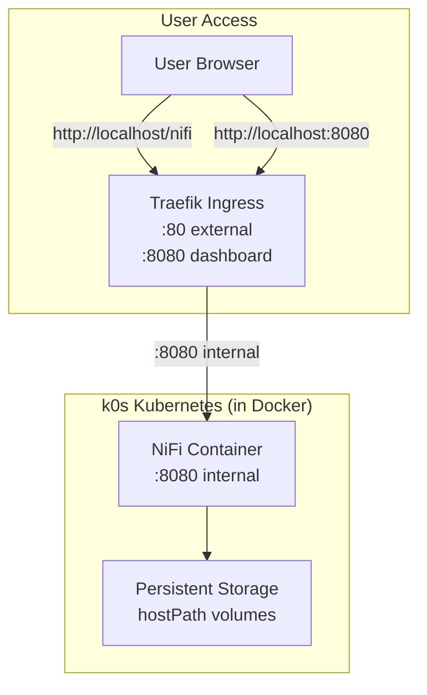
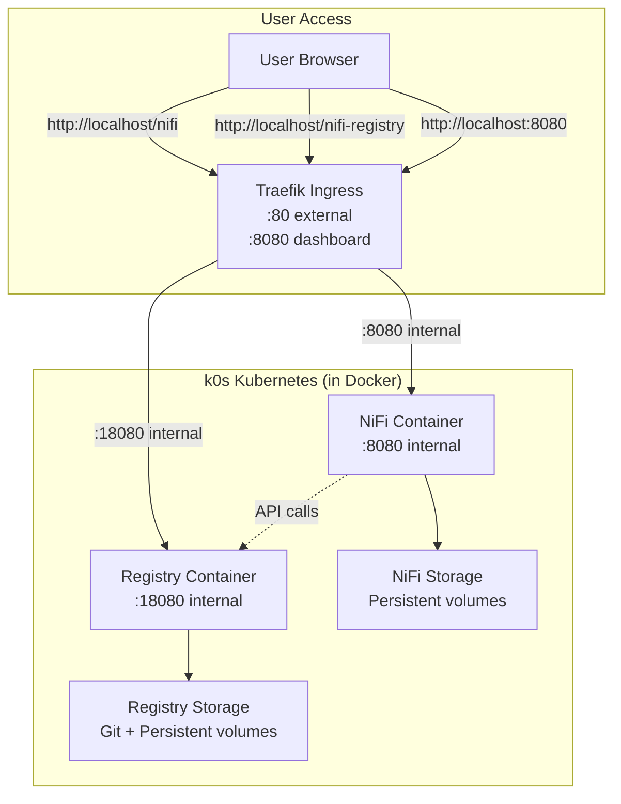

# InfoMetis

InfoMetis - container orchestration made simple.

**Purpose**: Prototype platform for lightweight, event-driven container orchestration using Kubernetes + NiFi data processing.

## 🗺️ Version Overview

| Version | Status | Focus | Documentation |
|---------|--------|-------|---------------|
| **v0.1.0** | ✅ **STABLE** | Foundation Platform | [📖 README](v0.1.0/README.md) |
| **v0.2.0** | 🚧 **ACTIVE** | Registry Integration | [📖 README](v0.2.0/README.md) |
| **v0.3.0** | 📋 **PLANNED** | JavaScript Console | - |
| **v0.4.0** | 📋 **PLANNED** | Elasticsearch Integration | - |
| **v0.5.0** | 📋 **PLANNED** | Grafana Monitoring | - |
| **v0.6.0** | 📋 **PLANNED** | Kafka Streaming | - |
| **v0.7.0** | 📋 **PLANNED** | Testing Framework | - |

## 📋 Milestone Status

| Milestone | Open Issues | Closed Issues | Status |
|-----------|-------------|---------------|---------|
| [v0.1.0: WSL NiFi Dev Platform](https://github.com/infometish/InfoMetis/milestone/1) | 4 | 4 | 🚧 Active |
| [v0.2.0: NiFi Registry with Git](https://github.com/infometish/InfoMetis/milestone/2) | 0 | 5 | ✅ Complete |
| [v0.3.0: Convert Console to JS](https://github.com/infometish/InfoMetis/milestone/6) | 0 | 0 | 📋 Planned |
| [v0.4.0: Elasticsearch Integration](https://github.com/infometish/InfoMetis/milestone/3) | 8 | 0 | 📋 Planned |
| [v0.5.0: Grafana Monitoring](https://github.com/infometish/InfoMetis/milestone/5) | 8 | 0 | 📋 Planned |
| [v0.6.0: Kafka Streaming](https://github.com/infometish/InfoMetis/milestone/4) | 8 | 0 | 📋 Planned |
| [v0.7.0: Testing Framework](https://github.com/infometish/InfoMetis/milestone/7) | 4 | 0 | 📋 Planned |

## 🚀 Quick Start

### Ready for Use: v0.1.0
```bash
cd v0.1.0
node console.js
```
- **Features**: k0s + Traefik + NiFi, Interactive Console, Offline Support
- **Access**: http://localhost/nifi (admin/adminadminadmin), http://localhost:8080 (Traefik Dashboard)

### Latest Features: v0.2.0  
```bash
cd v0.2.0
node console.js
```
- **Features**: All v0.1.0 + NiFi Registry + Git Integration + Flow Version Control
- **Access**: http://localhost/nifi, http://localhost/nifi-registry, http://localhost:8080 (Traefik Dashboard)

## 📊 Project Status

**✅ Ready for Use:**
- v0.1.0: Stable foundation platform
- v0.2.0: Registry integration functional, comprehensive testing complete

**🧪 Testing:**
- Automated test suite: `v0.2.0/implementation/T1-*-*.sh` 
- Comprehensive validation included

**📋 Next Steps:**
- v0.3.0: Convert console to native JavaScript implementations
- Enhanced testing framework development

## 🏗️ Architecture

### v0.1.0 Foundation


### v0.2.0 Registry Integration  


## 🔧 Key Features

**Common Platform:**
- Simple deployment via interactive console
- Data persistence across container restarts  
- Local-only deployment (no external dependencies)
- Comprehensive documentation and testing

**v0.1.0 Specific:**
- Offline deployment with image caching
- Validated deployment scripts
- Traefik dashboard monitoring

**v0.2.0 Specific:**
- NiFi Registry with Git version control
- Flow versioning and backup
- Registry-NiFi integration
- Automated test suite

## 📚 Documentation

- **[v0.1.0 README](v0.1.0/README.md)** - Foundation platform deployment guide
- **[v0.2.0 README](v0.2.0/README.md)** - Registry integration guide  
- **[Console UI Roadmap](docs/console-ui-roadmap.md)** - Console development plan
- **[Implementation Roadmap](docs/implementation-console-roadmap.md)** - Implementation strategy

## 🤝 Contributing

**Test the Platform:**
```bash
# Test v0.2.0 (latest)
cd v0.2.0
./implementation/T1-01-full-cleanup-reset.sh
./implementation/T1-07-validate-end-to-end.sh

# Test v0.1.0 (stable)  
cd v0.1.0
node console.js
```

**Report Issues:**
- Use [GitHub Issues](https://github.com/infometish/InfoMetis/issues)
- Include version, environment, and reproduction steps

**Development:**
- Check open milestones for planned features
- Follow existing code patterns and testing practices
- All contributions welcome: documentation, testing, features

---

**InfoMetis** | **Prototype Platform** | **Kubernetes + NiFi + JavaScript Console**