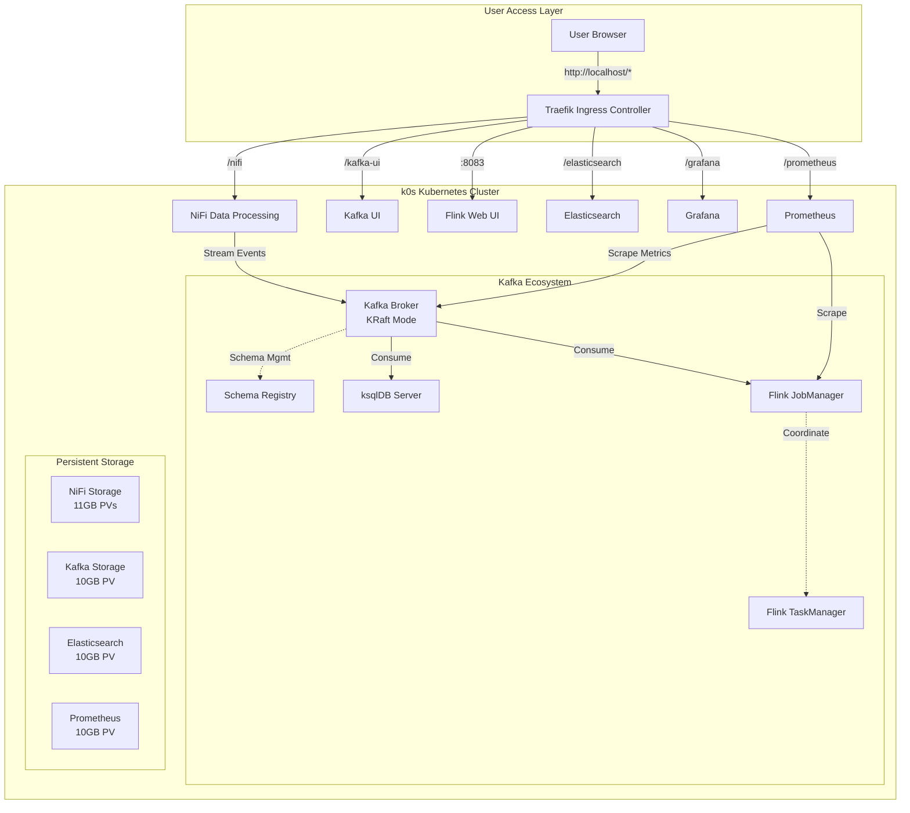

# InfoMetis

InfoMetis - container orchestration made simple.

**Purpose**: Prototype platform for lightweight, event-driven container orchestration using Kubernetes + NiFi data processing.

## 🗺️ Version Overview

| Version | Status | Focus | Documentation |
|---------|--------|-------|---------------|
| **v0.1.0** | ✅ **COMPLETE** | Foundation Platform | [📖 README](v0.1.0/README.md) |
| **v0.2.0** | ✅ **COMPLETE** | Registry Integration | [📖 README](v0.2.0/README.md) |
| **v0.3.0** | ✅ **COMPLETE** | JavaScript Console | [📖 README](v0.3.0/README.md) |
| **v0.4.0** | ✅ **COMPLETE** | Complete Analytics Platform + Composable Architecture | [📖 README](v0.4.0/README.md) |
| **v0.5.0** | ✅ **COMPLETE** | Kafka Ecosystem Platform | [📖 README](v0.5.0/README.md) |
| **v0.6.0** | 📋 **PLANNED** | Basic Integration Testing | - |
| **v0.7.0** | 📋 **PLANNED** | Advanced Integration Testing & Prototype Validation | - |

## 📋 Milestone Status

| Milestone | Open Issues | Closed Issues | Status |
|-----------|-------------|---------------|---------|
| [v0.1.0: WSL NiFi Dev Platform](https://github.com/infometish/InfoMetis/milestone/1) | 0 | 8 | ✅ Complete |
| [v0.2.0: NiFi Registry with Git](https://github.com/infometish/InfoMetis/milestone/2) | 0 | 5 | ✅ Complete |
| [v0.3.0: Convert Console to JS](https://github.com/infometish/InfoMetis/milestone/6) | 0 | 4 | ✅ Complete |
| [v0.4.0: Complete Analytics Platform](https://github.com/infometish/InfoMetis/milestone/3) | 0 | 18 | ✅ Complete |
| [v0.5.0: Kafka Ecosystem Component Deployment](https://github.com/infometish/InfoMetis/milestone/5) | 0 | 24 | ✅ Complete |
| [v0.6.0: Basic Integration Testing](https://github.com/infometish/InfoMetis/milestone/4) | 0 | 8 | 📋 Planned |
| [v0.7.0: Advanced Integration Testing & Prototype Validation](https://github.com/infometish/InfoMetis/milestone/7) | 0 | 4 | 📋 Planned |

## 🚀 Quick Start

### Latest: v0.5.0 (Kafka Ecosystem Platform)
```bash
cd v0.5.0
node console.js
```
- **Features**: Complete Kafka ecosystem with Flink, ksqlDB, Schema Registry + all v0.4.0 components
- **New Components**: Apache Flink (stream processing), ksqlDB (streaming SQL), Schema Registry (schema management), Prometheus (monitoring)
- **Access**: All v0.4.0 endpoints + http://localhost:8083 (Flink), http://localhost/prometheus, ksqlDB via CLI
- **Documentation**: Comprehensive [Prototyping Guide](v0.5.0/docs/PROTOTYPING_GUIDE.md) with hands-on tutorials

### JavaScript Console: v0.3.0 (Ready for Use)
```bash
cd v0.3.0
node console.js
```
- **Features**: Complete JavaScript Implementation + Enhanced UI + Manifest-Based Deployments
- **Access**: http://localhost/nifi, http://localhost/nifi-registry (admin/infometis2024), http://localhost:8082 (Traefik Dashboard)

### Registry Integration: v0.2.0 (Stable)
```bash
cd v0.2.0
node console.js
```
- **Features**: All v0.1.0 + NiFi Registry + Git Integration + Flow Version Control
- **Access**: http://localhost/nifi, http://localhost/nifi-registry, http://localhost:8082 (Traefik Dashboard)

### Foundation: v0.1.0 (Stable)
```bash
cd v0.1.0
node console.js
```
- **Features**: k0s + Traefik + NiFi, Interactive Console, Offline Support
- **Access**: http://localhost/nifi (admin/adminadminadmin), http://localhost:8080 (Traefik Dashboard)

## 📊 Project Status

**✅ Complete Versions:**
- v0.5.0: Kafka ecosystem platform - Complete streaming analytics with Flink + ksqlDB + Schema Registry + Prometheus monitoring
- v0.4.0: Complete analytics platform with composable architecture (carambah/) - NiFi + Elasticsearch + Grafana + Kafka + enhanced JavaScript console
- v0.3.0: JavaScript console implementation with enhanced reliability and cross-platform support
- v0.2.0: Registry integration with comprehensive testing and Git version control
- v0.1.0: Foundation platform with k0s + Traefik + NiFi

**📋 Planned Development:**
- v0.6.0: Basic Integration Testing (cross-component connectivity validation)
- v0.7.0: Advanced Integration Testing & Prototype Validation (enterprise-grade testing framework)

**🏗️ Architecture Evolution:**
- v0.4.0 introduced composable architecture foundation in `carambah/`
- Self-contained components with independent deployment capabilities
- Enhanced container pattern with dormant deployment assets
- Multi-environment support (Kubernetes, Docker Compose, standalone)

## 🏗️ Architecture

### v0.5.0 Kafka Ecosystem Platform


### v0.4.0 Complete Analytics Platform


### v0.2.0 Registry Integration  


## 🔧 Key Features

**Common Platform:**
- Simple deployment via interactive console
- Data persistence across container restarts  
- Local-only deployment (no external dependencies)
- Comprehensive documentation and testing

**v0.4.0 Specific (Complete Analytics Platform + Composable Architecture):**
- **Full Analytics Stack**: NiFi + Elasticsearch + Grafana + Kafka integration
- **Composable Architecture**: Self-contained components in `carambah/components/`
- **Enhanced Container Pattern**: Dormant deployment assets with zero runtime overhead
- **Multi-Environment Support**: Kubernetes, Docker Compose, standalone deployment
- **Independent Components**: Each component deployable separately with own CLI
- **Orchestrator Platform**: Multi-component stack deployment via `carambah/orchestrator/`
- **Real-time Streaming**: Apache Kafka with KRaft mode (Zookeeper-free)
- **Search & Analytics**: Elasticsearch for log aggregation and full-text search
- **Monitoring & Visualization**: Grafana for custom dashboards and metrics
- **Advanced Routing**: Traefik middleware for clean URL paths

**v0.3.0 Specific:**
- Complete JavaScript implementation (no bash dependencies)
- Interactive console with auto-execution modes
- Enhanced error handling and deployment verification  
- Cross-platform compatibility (Windows, macOS, Linux)
- Manifest-based deployments for improved reliability
- Bold progress feedback and visual confirmations

**v0.2.0 Specific:**
- NiFi Registry with Git version control
- Flow versioning and backup
- Registry-NiFi integration
- Automated test suite

**v0.1.0 Specific:**
- Offline deployment with image caching
- Validated deployment scripts
- Traefik dashboard monitoring

## 📚 Documentation

- **[v0.4.0 README](v0.4.0/README.md)** - Complete analytics platform (LATEST)
- **[v0.3.0 README](v0.3.0/README.md)** - JavaScript console implementation
- **[v0.2.0 README](v0.2.0/README.md)** - Registry integration guide  
- **[v0.1.0 README](v0.1.0/README.md)** - Foundation platform deployment guide

## 🤝 Contributing

**Test the Platform:**
```bash
# Test v0.4.0 (complete analytics platform - latest)
cd v0.4.0
node console.js

# Test v0.3.0 (javascript console - ready for use)
cd v0.3.0
node console.js

# Test v0.2.0 (stable with Registry)
cd v0.2.0
./implementation/T1-01-full-cleanup-reset.sh
./implementation/T1-07-validate-end-to-end.sh

# Test v0.1.0 (foundation)  
cd v0.1.0
node console.js
```

**Report Issues:**
- Use [GitHub Issues](https://github.com/infometish/InfoMetis/issues)
- Include version, environment, and reproduction steps

**Development:**
- Check open milestones for planned features
- Follow existing code patterns and testing practices
- All contributions welcome: documentation, testing, features

---

**InfoMetis** | **Composable Analytics Platform** | **Kubernetes + NiFi + Elasticsearch + Grafana + Kafka + Composable Architecture**