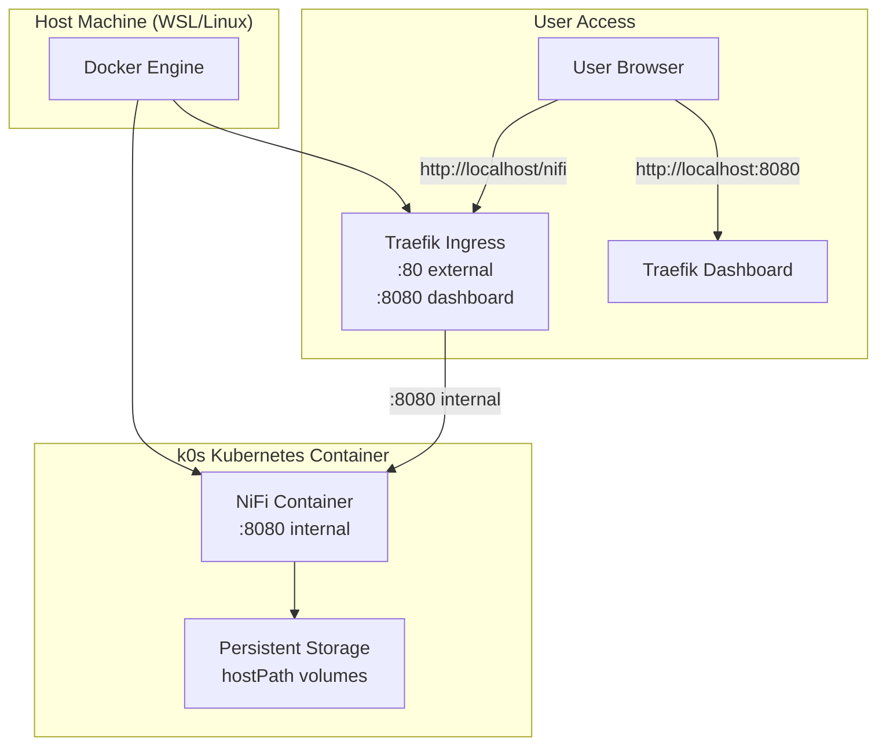

# InfoMetis v0.1.0: Foundation Platform

**Prototype**: Ready-for-use NiFi development platform with interactive console deployment.

Self-contained implementation package featuring k0s Kubernetes, Traefik ingress, and NiFi processing.

## 🚀 Quick Start

```bash
# Interactive deployment
node console.js

# Quick auto-deployment
node console.js
> a                    # Auto-execute all sections

# Manual deployment
> C                    # Cleanup and Caching section  
> I                    # Infrastructure section
> D                    # Deployment section
```

**Access Points:**
- **NiFi UI**: http://localhost/nifi (admin/adminadminadmin)
- **Traefik Dashboard**: http://localhost:8080/dashboard/

## 🏗️ Architecture



## 🎮 Console Navigation

**Section-based navigation** with single-letter commands:

| Section | Key | Purpose |
|---------|-----|---------|
| **Cleanup and Caching** | `C` | Environment cleanup, image caching |
| **Infrastructure** | `I` | Kubernetes cluster setup |
| **Deployment** | `D` | Application deployment |
| **Troubleshooting** | `T` | Fixes and diagnostics |
| **CAI Testing** | `X` | Experimental features |

**Commands:**
- `a` - Auto sequential execution
- `b` - Back to main menu  
- `status` - Show detailed status
- `q` - Quit

## 📁 Structure

```
v0.1.0/
├── console.js                 # Interactive deployment console
├── implementation/            # All deployment scripts
│   ├── C1-cleanup-all.sh     # Full environment cleanup
│   ├── C2-cache-images.sh    # Offline image caching
│   ├── I1-setup-cluster.sh   # k0s cluster setup
│   ├── I2-deploy-traefik.sh  # Traefik ingress setup
│   ├── D1-deploy-nifi.sh     # NiFi application deployment
│   └── D2-verify-deployment.sh # Deployment verification
├── manifests/                # Kubernetes YAML manifests
└── cache/                    # Cached container images
```

## 🔧 Key Features

**Ready for Use:**
- Interactive console with guided deployment
- Offline deployment via image caching  
- Persistent storage for data retention
- Comprehensive deployment validation

**Technical Stack:**
- **k0s Kubernetes** - Lightweight container orchestration
- **Traefik** - Modern ingress controller with dashboard
- **NiFi** - Content-aware intelligence platform
- **Docker** - Container runtime
- **Node.js** - Console interface

**Platform Benefits:**
- Single-command deployment
- Data persistence across restarts
- Local-only setup (no external dependencies)
- Validated deployment scripts

## 🧪 Testing

```bash
# Full deployment test
node console.js > a

# Manual verification
./implementation/D2-verify-deployment.sh

# Access validation
curl http://localhost/nifi/nifi-api/system-diagnostics
```

## 🔍 Troubleshooting

**Common Issues:**
```bash
# Console won't start
npm install

# Deployment failures  
./implementation/C1-cleanup-all.sh
./implementation/T1-restart-services.sh

# Check status
kubectl get pods -A
docker ps
```

**Resource Requirements:**
- Docker installed and running
- 8GB+ RAM available
- Node.js v14+ for console
- Port 80, 8080 available

## 📋 What's Included

**✅ Complete Platform:**
- k0s Kubernetes cluster in Docker
- Traefik ingress with dashboard access
- NiFi deployment with persistent storage
- Interactive console interface
- Offline deployment capability

**✅ Platform Features:**
- Persistent data storage
- Service monitoring via Traefik dashboard  
- Comprehensive deployment validation
- Detailed troubleshooting guides

**✅ Development Ready:**
- Clear script structure for customization
- Modular deployment components
- Extensible console interface
- Complete documentation

---

**InfoMetis v0.1.0** | **Foundation Platform** | **k0s + Traefik + NiFi**