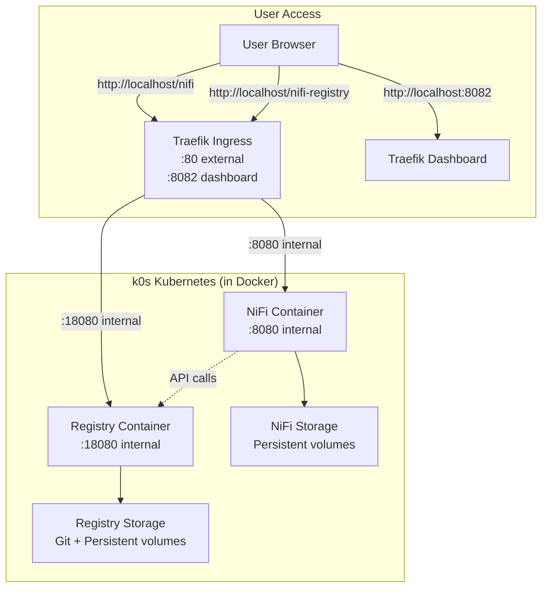

# InfoMetis v0.2.0: NiFi Registry with Git Integration

**Prototype**: NiFi Registry integration with Git version control for flow management.

Interactive console-driven deployment extending v0.1.0 foundation with Registry capabilities.

## 🚀 Quick Start (Recommended: Console Mode)

```bash
# Start the interactive console
node console.js
```

The console provides a guided experience with four main sections:
- **🧹 Cleanup and Caching** (key: `c`) - Environment preparation
- **🏗️ v0.1.0 Foundation** (key: `d`) - Core infrastructure deployment  
- **🗂️ Registry Implementation** (key: `i`) - NiFi Registry with Git integration
- **🧪 Test 1: End-to-End Integration** (key: `t1`) - Comprehensive testing

### Console Usage Examples

```bash
# Start console and follow guided deployment
node console.js

# Quick sequential deployment (auto-mode)
node console.js
> a                    # Auto-execute all sections sequentially

# Manual section-by-section
node console.js
> d                    # Deploy foundation
> i                    # Deploy Registry
> t1                   # Run end-to-end tests

# Check deployment status
node console.js
> status               # View current deployment state
```

## 🎯 Console Interface Features

### Interactive Navigation
- **Section Browsing**: Type section key (`c`, `d`, `i`, `t1`) to view steps
- **Auto-Execution**: Type `a` for full sequential deployment
- **Status Checking**: Type `status` for current deployment state
- **Quick Access**: Direct URLs and credentials displayed

### Visual Feedback
- **📋 Progress Tracking**: Visual indicators for completed steps
- **🌐 Access URLs**: Direct links to NiFi UI, Registry UI, and Traefik Dashboard
- **⚠️ Error Handling**: Clear error messages with troubleshooting guidance
- **✅ Success Confirmation**: Step-by-step completion verification

### Smart Features
- **Last Executed Tracking**: Console remembers your progress
- **Authentication Display**: Shows credentials when needed
- **URL Quick Access**: One-click access to web interfaces
- **Contextual Help**: Relevant next steps and troubleshooting

## 🌐 Access Points

The console automatically displays these URLs when services are ready:

- **NiFi UI**: http://localhost/nifi (admin/adminadminadmin)
- **Registry UI**: http://localhost/nifi-registry  
- **Traefik Dashboard**: http://localhost:8082

## 📁 Console Structure

```
v0.2.0/
├── console.js                     # 🎮 Interactive deployment console
├── config/console/
│   └── console-config.json        # Console configuration
└── implementation/
    ├── C1-cleanup-all.sh          # 🧹 Full environment cleanup
    ├── C2-cache-images.sh         # 📦 Image caching
    ├── D1-deploy-v0.1.0-foundation.sh    # 🏗️ k0s + Traefik
    ├── D2-deploy-v0.1.0-infometis.sh     # 🏗️ NiFi deployment
    ├── D3-verify-v0.1.0-foundation.sh    # 🏗️ Foundation verification
    ├── I1-deploy-registry.sh             # 🗂️ Registry deployment
    ├── I2-configure-git-integration.sh   # 🗂️ Git flow persistence
    ├── I3-configure-registry-nifi.sh     # 🗂️ Registry-NiFi integration
    ├── I4-verify-registry-setup.sh       # 🗂️ Registry verification
    ├── T1-01-full-cleanup-reset.sh       # 🧪 Test cleanup
    ├── T1-02-verify-clean-state.sh       # 🧪 Clean state verification
    ├── T1-03-create-single-pipeline.sh   # 🧪 Test pipeline creation
    ├── T1-04-verify-pipeline-creation.sh # 🧪 Pipeline verification
    ├── T1-05-version-pipeline.sh         # 🧪 Version control setup
    ├── T1-06-verify-registry-storage.sh  # 🧪 Storage verification
    └── T1-07-validate-end-to-end.sh      # 🧪 End-to-end validation
```

## 🎮 Console Workflow Guide

### 1. First-Time Setup
```bash
node console.js
> c                    # Cleanup and cache images
> d                    # Deploy foundation (k0s + NiFi)
> i                    # Deploy Registry with Git integration
```

### 2. Testing and Validation
```bash
> t1                   # Run comprehensive end-to-end tests
```

### 3. Development Cycle
```bash
# After making changes, reset and test
> c                    # Clean environment
> d                    # Redeploy foundation
> i                    # Redeploy Registry
> t1                   # Verify everything works
```

### 4. Quick Status Check
```bash
> status               # Check all deployments and services
```

## 📝 Flow Version Control Workflow

The console guides you through setting up version control, but here's the manual workflow:

### Through NiFi UI (Recommended)
1. **Access NiFi**: `http://localhost/nifi` (admin/adminadminadmin)
2. **Create Flow**: Design your data processing pipeline
3. **Start Version Control**:
   - Right-click Process Group → "Version" → "Start version control"
   - Select "InfoMetis Registry" 
   - Choose "InfoMetis Flows" bucket
   - Enter flow name and commit message

### Through Console Testing (Automated)
The `T1` test suite includes automated pipeline creation and version control:
- **T1-03**: Creates test pipeline automatically
- **T1-05**: Attempts automated version control setup
- **T1-06**: Verifies flow storage in Registry

### Git Integration
- **Automatic**: Flow versions are automatically saved to Git repository in Registry
- **External Git**: Use `setup-git-integration.sh` for external repository integration

## 🧪 Testing & Verification

### Console Test Suite (T1)
The console includes a comprehensive test suite accessible via `t1`:

1. **T1-01**: Full cleanup and reset
2. **T1-02**: Verify clean environment state  
3. **T1-03**: Create test pipeline automatically
4. **T1-04**: Verify pipeline creation and configuration
5. **T1-05**: Set up version control (automated + manual options)
6. **T1-06**: Verify Registry storage and Git persistence
7. **T1-07**: Complete end-to-end integration validation

### Manual Testing
```bash
# Individual script execution (if needed)
./implementation/I4-verify-registry-setup.sh
./implementation/T1-07-validate-end-to-end.sh
```

## 🔧 Advanced Configuration

### Console Customization
Edit `config/console/console-config.json` to:
- Add new sections or steps
- Modify descriptions and icons  
- Update URLs and authentication
- Customize workflow order

### Image Configuration
Container images managed in `config/image-config.env`:
```bash
K0S_IMAGE="k0sproject/k0s:v1.29.1-k0s.0"
TRAEFIK_IMAGE="traefik:v2.9"
NIFI_IMAGE="apache/nifi:1.23.2"
NIFI_REGISTRY_IMAGE="apache/nifi-registry:1.23.2"
```

## 🔍 Troubleshooting

### Console Issues
```bash
# Console won't start
npm install                    # Ensure Node.js dependencies

# Scripts fail to execute  
chmod +x implementation/*.sh   # Make scripts executable

# Permission issues
sudo chown -R $USER:$USER .   # Fix file ownership
```

### Deployment Issues
The console provides contextual troubleshooting, but common fixes:

```bash
# Check deployments
kubectl get pods -A

# View logs (shown in console status)
kubectl logs -n infometis statefulset/nifi
kubectl logs -n infometis deployment/nifi-registry

# Reset environment
node console.js > c            # Full cleanup and restart
```

### Access Issues
- **Services not accessible**: Check Traefik routing in console status
- **Registry redirects**: Fixed in v0.2.0 routing configuration
- **Authentication errors**: Credentials displayed in console interface

## 🏗️ Architecture



## ✅ What's New in v0.2.0

### Console Interface
- [x] **Interactive Console**: Node.js-based guided deployment interface
- [x] **Visual Progress Tracking**: Real-time status and completion indicators
- [x] **Auto-Execution Mode**: One-command full deployment
- [x] **Contextual Help**: Error handling and troubleshooting guidance

### Registry Integration  
- [x] **NiFi Registry Deployment**: StatefulSet with persistent storage
- [x] **Git Flow Persistence**: Automatic version control for NiFi flows
- [x] **Registry-NiFi Integration**: Seamless flow version control client
- [x] **Traefik Routing**: Fixed Registry UI access at `/nifi-registry`

### Testing Framework
- [x] **Comprehensive Test Suite**: 7-step end-to-end integration testing
- [x] **Automated Pipeline Creation**: Test flows created programmatically  
- [x] **Hybrid Version Control**: API automation with manual UI fallback
- [x] **Smart Infrastructure Detection**: Handles existing flows and configurations

## 🚧 Future Enhancements

- **Enhanced Console Features**: Plugin system, custom workflows
- **Remote Git Integration**: External repository synchronization
- **Multi-Environment Support**: Dev/staging/prod workflow management
- **CI/CD Integration**: Automated flow deployment pipelines
- **Advanced Security**: Authentication and RBAC integration

---

**🎮 Start with the Console** | **Interactive Guided Deployment** | **Node.js + Kubernetes + Docker**

```bash
# Get started now
node console.js
```