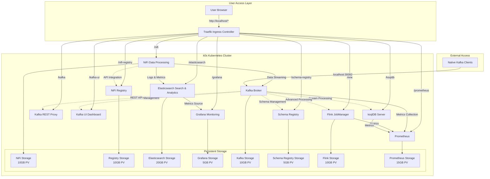

# InfoMetis v0.5.0: Kafka Ecosystem Component Deployment

**Enhanced Analytics Platform**: Comprehensive Kafka ecosystem deployment including Schema Registry, Flink, ksqlDB, and Prometheus monitoring, extending the complete analytics platform from v0.4.0.

v0.5.0 expands the Kafka capabilities by adding essential ecosystem components: Schema Registry for schema management, Apache Flink for advanced stream processing, ksqlDB for SQL-based stream analytics, and Prometheus for comprehensive monitoring - creating a complete enterprise-grade streaming analytics platform.

## 🎯 Quick Start

```bash
cd v0.5.0
node console.js
```

**Enhanced Platform Access:**
- **NiFi UI**: http://localhost/nifi (admin/infometis2024)
- **NiFi Registry UI**: http://localhost/nifi-registry (admin/infometis2024)
- **Elasticsearch**: http://localhost/elasticsearch
- **Grafana UI**: http://localhost/grafana (admin/admin)
- **Kafka REST API**: http://localhost/kafka
- **Kafka UI**: http://localhost/kafka-ui
- **Schema Registry**: http://localhost/schema-registry
- **ksqlDB Server**: http://localhost/ksqldb
- **Flink Web UI**: http://localhost/flink
- **Prometheus**: http://localhost/prometheus
- **Traefik Dashboard**: http://localhost:8082

## 🏗️ Architecture: Enhanced Kafka Ecosystem

### **Complete Platform Components + Kafka Ecosystem**


### **Module Structure**
```
v0.5.0/
├── console.js                          # Main console entry point
├── console/
│   ├── console-core.js                 # Core console functionality
│   └── interactive-console.js          # Enhanced menu interface
├── config/
│   ├── image-config.js                 # All container images
│   ├── console/console-config.json     # Console configuration
│   └── manifests/                      # Static Kubernetes manifests
│       ├── elasticsearch-k8s.yaml     # Elasticsearch deployment
│       ├── grafana-k8s.yaml           # Grafana deployment  
│       ├── kafka-k8s.yaml             # Complete Kafka stack
│       ├── schema-registry-k8s.yaml   # Schema Registry deployment
│       ├── flink-k8s.yaml             # Apache Flink deployment
│       ├── ksqldb-k8s.yaml            # ksqlDB deployment
│       ├── prometheus-k8s.yaml        # Prometheus monitoring
│       ├── nifi-k8s.yaml              # NiFi deployment
│       ├── nifi-registry-k8s.yaml     # Registry deployment
│       └── traefik-deployment.yaml    # Ingress controller
├── implementation/                     # JavaScript deployment modules
│   ├── deploy-elasticsearch.js        # Elasticsearch deployment
│   ├── deploy-grafana.js              # Grafana deployment
│   ├── deploy-kafka.js                 # Kafka complete deployment
│   ├── deploy-schema-registry.js      # Schema Registry deployment
│   ├── deploy-flink.js                # Apache Flink deployment
│   ├── deploy-ksqldb.js               # ksqlDB deployment
│   ├── deploy-prometheus.js           # Prometheus monitoring
│   ├── deploy-k0s-cluster.js          # Kubernetes cluster
│   ├── deploy-traefik.js              # Ingress controller
│   ├── deploy-nifi.js                 # NiFi application
│   ├── deploy-registry.js             # Registry application
│   └── cache-images.js                # Image caching system
└── lib/                               # Utility libraries
    ├── logger.js                      # Enhanced logging system
    ├── exec.js                        # Process execution wrapper
    ├── docker/docker.js               # Docker operations
    ├── kubectl/kubectl.js             # Kubernetes operations
    └── fs/config.js                   # Configuration management
```

## 🔧 Key Features

### **Complete Analytics Platform**
- **Data Processing**: NiFi with 400+ processors for complex data transformations
- **Real-time Streaming**: Apache Kafka with KRaft mode (Zookeeper-free)
- **Search & Analytics**: Elasticsearch for full-text search and log aggregation
- **Monitoring & Visualization**: Grafana with customizable dashboards
- **Version Control**: NiFi Registry for flow versioning and backup
- **Unified Access**: Single-point web access through Traefik ingress

### **Production-Ready Infrastructure**
- **Kubernetes Orchestration**: k0s single-node cluster in Docker
- **Persistent Storage**: All components with dedicated persistent volumes
- **Image Caching**: Complete offline deployment capability  
- **Static Manifests**: Reliable Kubernetes manifest-based deployments
- **Cross-Platform**: Windows, macOS, Linux, and WSL compatibility
- **JavaScript Console**: Enhanced interactive deployment interface

### **Advanced Integration Capabilities**
- **Hybrid Data Access**: REST APIs + Native protocols + Web UIs
- **Multi-Protocol Support**: HTTP REST, Kafka native, Elasticsearch API
- **NodePort Access**: Direct Kafka access for external clients (port 30092)
- **Path-based Routing**: Clean URL structure through Traefik middleware
- **Unified Authentication**: Consistent credentials across all components

## 📊 Component Details

### **🔍 Elasticsearch Integration**
```yaml
# Elasticsearch Features
- Version: 8.15.0
- Storage: 20GB persistent volume
- Access: http://localhost/elasticsearch
- Configuration: Single-node cluster with security disabled for development
- Use Cases: Log aggregation, full-text search, analytics queries
```

### **📈 Grafana Monitoring**
```yaml
# Grafana Features  
- Version: 10.2.0
- Storage: 5GB persistent volume
- Access: http://localhost/grafana (admin/admin)
- Configuration: Sub-path routing with persistent dashboards
- Data Sources: Elasticsearch integration ready
```

### **🚀 Apache Kafka Streaming**
```yaml
# Kafka Features
- Version: 7.5.0 (Confluent Platform)
- Mode: KRaft (Zookeeper-free architecture)
- Storage: 10GB persistent volume
- Access Methods:
  - REST API: http://localhost/kafka (HTTP interface)
  - Web UI: http://localhost/kafka-ui (browser management)
  - Native: localhost:30092 (Kafka protocol)
  - Internal: kafka-service:9092 (cluster access)
```

### **Enhanced NiFi Platform**
```yaml
# NiFi Features (from v0.3.0)
- Version: 1.23.2
- Storage: 10GB persistent volume  
- Access: http://localhost/nifi (admin/infometis2024)
- Registry Integration: http://localhost/nifi-registry
- New Capabilities: Ready for Elasticsearch and Kafka integration
```

## 🎮 Console Interface

### **Enhanced Menu System**
```bash
cd v0.4.0
node console.js

🔍 PREREQUISITES: Requirements check and image caching
☸️  KUBERNETES CLUSTER: Deploy k0s cluster and Traefik ingress controller  
🚀 DEPLOYMENTS: Deploy NiFi, Elasticsearch, Grafana, Kafka and other applications
🗑️  REMOVE DEPLOYMENTS: Remove NiFi, Elasticsearch, Grafana, Kafka and other applications
✅ VALIDATION AND TESTING: Validate deployment and run tests
```

### **Complete Platform Deployment**
```bash
# Auto-execute full platform deployment
p → a  # Prerequisites (check + cache images)
k → a  # Kubernetes (cluster + Traefik)  
d → a  # Deployments (all applications)
v → a  # Validation (health checks)

# Result: Complete analytics platform ready in ~10-15 minutes
```

### **Application-Specific Deployment**
```bash
# Deploy individual components
d → 1  # Deploy NiFi application
d → 2  # Deploy NiFi Registry  
d → 3  # Deploy Elasticsearch
d → 4  # Deploy Grafana
d → 5  # Deploy Kafka
d → 6  # Configure Registry integration
```

## 📋 Implementation Status

### **✅ Production Ready Features**
- **Complete Infrastructure**: k0s cluster with Traefik ingress controller
- **Full Application Stack**: NiFi + Registry + Elasticsearch + Grafana + Kafka
- **Persistent Storage**: All components with dedicated persistent volumes
- **Unified Access**: All web interfaces accessible through single domain
- **Image Caching**: Complete offline deployment capability
- **Cross-Platform**: JavaScript console works on all platforms
- **Static Manifests**: Reliable Kubernetes manifest-based deployments

### **✅ Advanced Analytics Capabilities**  
- **Data Processing**: NiFi with 400+ processors for ETL operations
- **Real-time Streaming**: Kafka for event-driven data pipelines
- **Search & Analytics**: Elasticsearch for log aggregation and full-text search
- **Monitoring & Visualization**: Grafana for custom dashboards and metrics
- **Version Control**: Registry for flow versioning and collaborative development
- **Multi-Protocol Access**: REST APIs, native protocols, and web interfaces

### **✅ Key Improvements over v0.3.0**
- **Complete Analytics Stack**: Added Elasticsearch, Grafana, and Kafka
- **Enhanced Console**: Remove Deployments section for better lifecycle management
- **Improved Storage**: Optimized persistent volume sizes for each component
- **Better Integration**: Components configured for seamless integration
- **Advanced Routing**: Traefik middleware for clean URL paths
- **Native Access**: Kafka NodePort for external client connectivity

## 🔬 Integration Examples

### **NiFi → Elasticsearch Pipeline**
```javascript
// NiFi processor configuration for Elasticsearch output
{
  "processor": "PutElasticsearchHttp", 
  "properties": {
    "elasticsearch_url": "http://elasticsearch-service:9200",
    "index": "nifi-logs",
    "type": "_doc"
  }
}
```

### **Kafka → NiFi → Elasticsearch Flow**
```javascript
// Complete streaming analytics pipeline
ConsumeKafka → ProcessData → PutElasticsearchHttp
  ↓              ↓              ↓
Kafka Topics → Transform → Index in Elasticsearch → Visualize in Grafana
```

### **Grafana Dashboard Configuration**
```json
{
  "datasource": {
    "type": "elasticsearch",
    "url": "http://elasticsearch-service:9200",
    "index": "nifi-*",
    "timeField": "@timestamp"
  }
}
```

## 🧪 Testing the Platform

### **Full Platform Test**
```bash
# Complete deployment test
cd v0.4.0
node console.js

# Execute full workflow:
# p → a (Prerequisites)
# k → a (Kubernetes + Traefik)  
# d → a (All applications)
# v → a (Validation)

# Verify all components running:
# kubectl get pods -n infometis
```

### **Individual Component Tests**
```bash
# Test Elasticsearch
curl http://localhost/elasticsearch/_cluster/health

# Test Kafka REST API  
curl http://localhost/kafka/topics

# Test Grafana
curl -I http://localhost/grafana/api/health

# Test NiFi integration  
curl -I http://localhost/nifi/nifi-api/system-diagnostics
```

### **Data Pipeline Testing**
```bash
# Create Kafka topic via REST API
curl -X POST http://localhost/kafka/topics \
  -H "Content-Type: application/vnd.kafka.json.v2+json" \
  -d '{"name": "test-topic", "num_partitions": 1}'

# Send test message
curl -X POST http://localhost/kafka/topics/test-topic \
  -H "Content-Type: application/vnd.kafka.json.v2+json" \
  -d '{"records": [{"value": {"message": "Hello InfoMetis v0.4.0!"}}]}'
```

## 📚 Documentation

- **[v0.3.0 README](../v0.3.0/README.md)** - JavaScript console foundation
- **[v0.2.0 README](../v0.2.0/README.md)** - Registry integration
- **[v0.1.0 README](../v0.1.0/README.md)** - Platform foundation  
- **[Root README](../README.md)** - Project overview and version status

## 🤝 Contributing

**Testing the Complete Analytics Platform:**
```bash
# Full platform validation
cd v0.4.0
node console.js
# Test complete deployment workflow

# Component-specific testing
# Test individual deployments and integrations
# Verify cross-component data flows
```

**Development Guidelines:**
- Follow existing JavaScript module patterns
- Maintain static manifest approach for reliability
- Implement comprehensive error handling for all components
- Test integration scenarios between components
- Document configuration examples for advanced use cases

---

**InfoMetis v0.4.0** delivers a complete, production-ready analytics platform combining data processing (NiFi), real-time streaming (Kafka), search & analytics (Elasticsearch), and monitoring & visualization (Grafana) - all managed through an enhanced JavaScript console with persistent storage and cross-platform compatibility.

🎯 **Production Analytics Platform** - Complete Data Processing, Streaming, Search & Visualization Stack