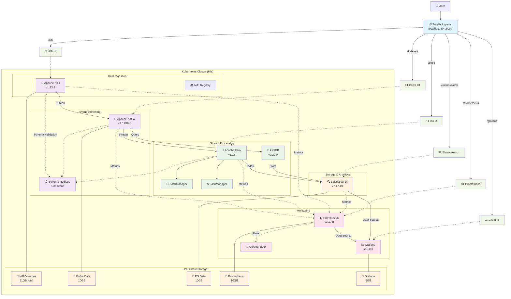

# InfoMetis v0.5.0 - Architecture Overview

> 🏗️ **Kafka-centric data platform for rapid prototyping**

## System Architecture



## Component Details

### 1. **Ingress Layer** - Traefik
- **Purpose**: Reverse proxy and load balancer
- **Features**:
  - Path-based routing to all services
  - Automatic SSL termination (when configured)
  - Service discovery via Kubernetes
- **Access**: Dashboard at http://localhost:8082

### 2. **Data Ingestion** - Apache NiFi
- **Version**: 1.23.2
- **Purpose**: Visual dataflow programming
- **Key Features**:
  - 300+ processors for data ingestion
  - Visual flow design
  - Built-in data provenance
  - Registry integration for version control
- **Storage**: 4 persistent volumes (content, database, flowfile, provenance)

### 3. **Event Streaming** - Apache Kafka
- **Version**: 3.6 (KRaft mode - no ZooKeeper)
- **Purpose**: Distributed event streaming platform
- **Configuration**:
  - Single broker (expandable)
  - 10GB persistent storage
  - Auto topic creation enabled
  - Default replication factor: 1
- **Interfaces**:
  - Native: `kafka-service:9092`
  - UI: Kafka UI for management

### 4. **Stream Processing**

#### Apache Flink
- **Version**: 1.18
- **Purpose**: Distributed stream processing
- **Architecture**:
  - JobManager: Coordinates jobs
  - TaskManager: Executes tasks
  - 2 task slots per TaskManager
- **Features**:
  - Exactly-once processing
  - Stateful computations
  - Checkpointing enabled

#### ksqlDB
- **Version**: 0.29.0
- **Purpose**: SQL interface for Kafka streams
- **Features**:
  - SQL on streams and tables
  - Push and pull queries
  - Kafka Streams under the hood

### 5. **Data Storage** - Elasticsearch
- **Version**: 7.17.10
- **Purpose**: Search and analytics engine
- **Configuration**:
  - Single node setup
  - 10GB persistent storage
  - HTTP API exposed
  - Ready for time-series data

### 6. **Schema Management** - Schema Registry
- **Version**: Latest Confluent
- **Purpose**: Schema versioning and compatibility
- **Features**:
  - Avro, JSON Schema, Protobuf support
  - Schema evolution
  - Compatibility checking

### 7. **Monitoring Stack**

#### Prometheus
- **Version**: 2.47.0
- **Purpose**: Metrics collection and alerting
- **Targets**:
  - Kafka metrics (requires JMX exporter)
  - Flink metrics
  - Elasticsearch health
  - Node metrics (when available)

#### Grafana  
- **Version**: 10.0.3
- **Purpose**: Visualization and dashboards
- **Data Sources**:
  - Prometheus
  - Elasticsearch
  - Direct Kafka metrics

## Data Flow Patterns

### Pattern 1: Real-Time ETL
```
External API → NiFi → Kafka → Flink → Elasticsearch → Grafana
```

### Pattern 2: Stream Analytics
```
Kafka → ksqlDB → Materialized Views → REST API
```

### Pattern 3: Event Processing
```
NiFi → Kafka → Flink (CEP) → Alerts → Kafka → NiFi → Email/Slack
```

## Storage Architecture

### Persistent Volumes
- **Type**: Local storage with k0s
- **Locations**: `/tmp/*-data` directories
- **Lifecycle**: Delete policy (cleaned on removal)

### Volume Mappings
| Component | Volume | Size | Path |
|-----------|--------|------|------|
| NiFi | Content | 5Gi | `/opt/nifi/content_repository` |
| NiFi | Database | 1Gi | `/opt/nifi/database_repository` |
| NiFi | Flowfile | 2Gi | `/opt/nifi/flowfile_repository` |
| NiFi | Provenance | 3Gi | `/opt/nifi/provenance_repository` |
| Kafka | Data | 10Gi | `/var/lib/kafka/data` |
| Elasticsearch | Data | 10Gi | `/usr/share/elasticsearch/data` |
| Grafana | Data | 5Gi | `/var/lib/grafana` |
| Prometheus | TSDB | 10Gi | `/prometheus` |

## Network Architecture

### Service Discovery
- Internal DNS: `<service>.<namespace>.svc.cluster.local`
- Example: `kafka-service.infometis.svc.cluster.local`

### Port Mappings
| Service | Internal Port | Ingress Path |
|---------|--------------|--------------|
| NiFi | 8443 | `/nifi` |
| Kafka UI | 8080 | `/kafka-ui` |
| Flink | 8081 | `:8083` (dedicated) |
| Elasticsearch | 9200 | `/elasticsearch` |
| Grafana | 3000 | `/grafana` |
| Prometheus | 9090 | `/prometheus` |
| ksqlDB | 8088 | `/ksqldb` |

## Security Considerations

### Current State (Prototype)
- Basic authentication on NiFi
- No SSL between components
- Open network policies
- Default passwords

### Production Recommendations
1. Enable SSL/TLS everywhere
2. Implement SASL for Kafka
3. Use Kubernetes secrets
4. Network policies for isolation
5. External identity provider integration

## Scalability

### Horizontal Scaling Options
- **Kafka**: Add brokers, increase replication
- **Flink**: Add TaskManagers
- **Elasticsearch**: Convert to cluster mode
- **NiFi**: Add nodes for cluster mode

### Resource Requirements
| Component | CPU Request | Memory Request | Recommended |
|-----------|-------------|----------------|-------------|
| NiFi | 1000m | 2Gi | 2000m / 4Gi |
| Kafka | 1000m | 2Gi | 2000m / 4Gi |
| Flink JobManager | 500m | 1Gi | 1000m / 2Gi |
| Flink TaskManager | 500m | 1Gi | 1000m / 2Gi |
| Elasticsearch | 1000m | 2Gi | 2000m / 4Gi |
| Prometheus | 500m | 1Gi | 1000m / 2Gi |

## High Availability

### Current Limitations
- Single-node Kubernetes
- No data replication
- Single points of failure

### HA Upgrade Path
1. Multi-node Kubernetes cluster
2. Kafka replication factor > 1
3. Elasticsearch cluster mode
4. Flink HA with ZooKeeper
5. NiFi cluster with ZooKeeper

## Disaster Recovery

### Backup Strategies
1. **NiFi**: Export flows to Registry
2. **Kafka**: Topic backup via MirrorMaker
3. **Elasticsearch**: Snapshot API
4. **Persistent Volumes**: Regular backups of `/tmp/*-data`

### Recovery Procedures
- Full platform redeploy: ~15 minutes
- Data restore: Depends on volume size
- Configuration: Stored in Git

---

## Key Design Decisions

1. **KRaft Mode**: Kafka without ZooKeeper for simplicity
2. **Local Storage**: Fast prototyping without cloud dependencies
3. **Single Namespace**: All components in `infometis` namespace
4. **Init Containers**: Handle permission issues automatically
5. **Traefik Ingress**: Unified access point for all services

This architecture provides a complete data platform suitable for:
- Proof of concepts
- Development environments  
- Learning and experimentation
- Small-scale production with modifications